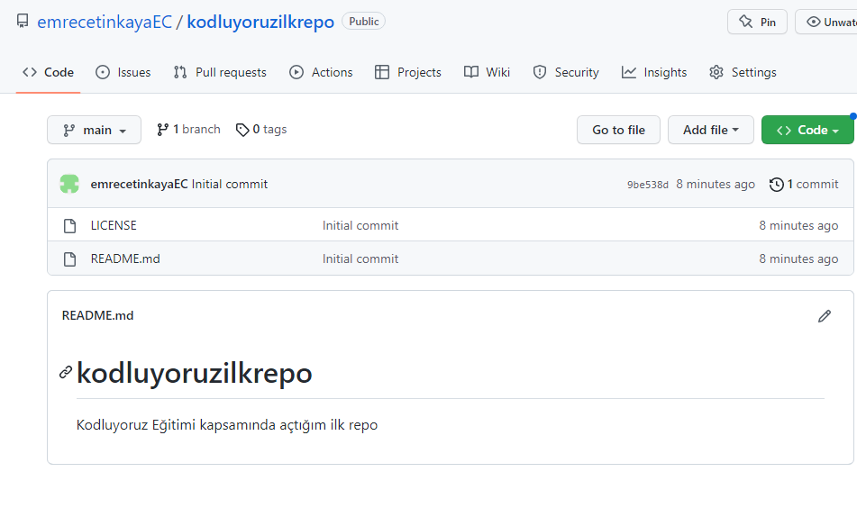

# Kodluyoruz Ilk Repo

Bu repo [Kodluyoruz](https://kodluyoruz.org/) Front-End eğitiminde oluşturduğumuz ilk repo. İçerisinde bir adet README dosyası, bir adet de index.html barındırıyor.




## Installation

Öcelikle projeyi clonelayın. (Buraya sizin reponuzdan aldığınız link gelecek)

```bash
git clone https://github.com/emrecetinkayaEC/kodluyoruzilkrepo.git
```

## Usage

Projeyi cloneledıktan sonra Visual Studio Code programında açınız.

Linux için :

```linux
cd kodluyoruzilkrepo
code .
```

## Constributing

Pull requestler kabul edilir. Büyük değişiklikler için, lütfen önce neyi değiştirmek istediğinizi tartışmak için bir konu açınız.

## License

[MIT](https://choosealicense.com/licenses/mit/) 

## Patika

[patika.dev](https://app.patika.dev/)